**PLUTUS PIONEER PROGRAM WEEK 2**

**Documentation Week 2**

**Creator: Kappos Angelos**

**Credits to: Sapiopool**

**Contents**

Topics covered in this lecture:
- Introduction
- PlutusTx.Data
- Triggering change.
- Low-level, untyped on-chain validation scripts.
    - Gift.hs
    - Burn.hs
    - FourtyTwo.hs
- High-level, typed on-chain validation scripts.
    - Typed.hs
    - isData.hs
- Plutus Validator

The on-chain part is about validation. It allows nodes to validate a given transaction and whether it is allowed to consume a given UTxO.
The off-chain part lives in the user’s wallet. It constructs and submits suitable transactions.
Both are important topics. We have to master both in order to write smart contracts, but for now we will concentrate on the on-chain part.

Focus of the lecture is the validation and not really the wallet. The wallet is already prepared inside code. (with grab and give buttons)

In the simple UTxO model are so-called public key addresses, where the address is given by the hash of the public key. If a UTxO sits at such a public key address, then a transaction can consume that UTxO as an input if the signature belonging to that public key is included in the transaction.

What the (E)UTxO model does is extend this by adding script addresses that can run arbitrary logic.
When a transaction wants to consume a UTxO sitting at a script address is validated by a node, the node will run the script and then, depending on the result of the script, decide whether the transaction is valid or not.
And recall that there were three more additions:
1. Instead of just having signatures on transactions, we have so-called Redeemers - arbitrary pieces of data.
2. On the UTxO output side, we have an additional arbitrary piece of data called Datum, which you can think of as a little piece of state that sits on the UTxO.
3. Finally, we have the context. There are various choices of what this context can be. It can be very restrictive, consisting just of the Redeemer (as in Bitcoin), or very global, consisting of the whole state of the blockchain (as in Ethereum). In Cardano, it is the transaction that is being validated, including all its inputs and outputs.
   So, there are three pieces of data that a Plutus script gets. The Datum, sitting at the UTxO, the Redeemer coming from the input and the validation, and the Context, consisting of the transaction being validated and its inputs and outputs.

As mentioned, the Datum, Redeemer and Context share a data type. That data type is defined in the package plutus-tx, in the module *PlutusTx.Data*. It is called, simply, Data.

```
data Data =
      Constr Integer [Data]
   | Map [(Data, Data)]
   | List [Data]
   | I Integer
   | B BS.ByteString
   deriving stock (Show, Eq, Ord, Generic)
   deriving anyclass (Serialise, NFData)
```
It has five constructors.

- Constr  takes an Integer and, recursively, a list of Data
- Map takes a list of pairs of Data. You can think of this as a lookup table of key-value pairs where both the key and the value are of type Data
- List takes a list of Data
- I takes a single Integer
- B takes a Bytestring
  For those familiar with the JSON format, this is very similar. The constructors are not exactly the same, but, like JSON, you can represent numbers, strings, lists of data and key-value pairs. It can represent arbitrary data, which makes it very suitable for our purpose.
  We can also explore this type in the REPL.

From the plutus-pioneers-program repository. Remember that you may need to start a nix-shell from the Plutus repository before changing into the week02 directory.
```
cd code/week02
cabal repl
```
You should get a response like the following:


1. Validator scripts: they're the code that the blockchain executes to decide if you should release locked up funds to a user or not.
2. Validator scripts receives 3 parameters: Datum, Redeemer, and Validation.
1. Datum is any data that a user who is locking up ADA sends ,
2. Redeemer is any data that a user who is trying to redeem the ADA sends, and
3. Validation Context is information about the transaction. The most common case to release funds is if the redeemer matches a condition in the validator script, otherwise it will throw a Validation Error
3. Any plutus script, needs a validator script

**GIFT.hs**

Time to start your playground:
Setting up the Plutus Playground

- Build the Plutus Playground Client / ServerIn plutus directory
```
nix-build -A plutus-playground.client 
nix-build -A plutus-playground.server
```

```
nix-shell
```

```
plutus-playground-server
```
And in a new terminal window:
```
cd plutus
nix-shell
cd plutus-playground-client
plutus-playground-server
npm run start
```
- on chain code --> code who runs on the blockchain - validator script
- off chain code --> wallet
- parameters of  Validation script

```
-- Datum
-- Redeem
-- context -- information about the transaction
{-# INLINABLE mkValidator #-} 
mkValidator :: Data -> Data -> Data -> () -- the simplest validator -first argument Datum, Second Reddemer, Third Context.
mkValidator _ _ _ = () -- this always succeeds

-- Notes: unit in Haskell is like void in any other programming languages(C, Java)
-- Unit is a built in type in Haskell and it has one value.
-- Here the _ represents the units which they have not any value yet. It doesn't care about any value of Datum, Redeem abd ---- context and it will always suceed. This creates a script where the validation succeeds.

{-# INLINABLE mkValidator #-}: -- this means that the code of this fuunction can be inlined, so when we call it here inside --- the brackets 
|| mkValidator || the compiler will inline code inside the brackets.
```
- Create validator
```
validator :: Validator 
validator = mkValidatorScript $$(PlutusTx.compile [|| mkValidator ||]) 
```
So, with this code we are asking the compiler to write the code for the validator function at compile time based on our mkValidator function, and then proceed with the normal compilation.

- create hash and script address:
  We have defined our first validator, and now we can define two more types.
  The one is the ValidatorHash, which is the hash of the Validator.
  And we turn the validator into a script address, which is the script's address on the blockchain.
```
valHash :: Ledger.ValidatorHash 
valHash = Scripts.validatorHash validator

scrAddress :: Ledger.Address 
scrAddress = ScriptAddress valHash
```
we have a script address represented as scrAddress.

In order to actually try this script, we need wallet code.  Two endpoints are defined. Endpoints are ways for a user to trigger something with input parameters.
The give endpoint will take an Integer argument to specify the number of lovelace that will be deposited to the contract.
The grab endpoint will take no argument and will simply look for UTxOs at this script address and consume them.

the functions that we click "give" "grab"
```
type GiftSchema = 
    BlockchainActions 
        .\/ Endpoint "give" Integer 
        .\/ Endpoint "grab" ()
```
Testing Gift Script
- The idea of this script is that we would deposit ADA into the script, and the one would grab the ADA.
  The way I ran the script in the Playground, I had Wallet 1 and Wallet 2 give ADA, and Wallet 3 grab ADA.  It worked as planned.

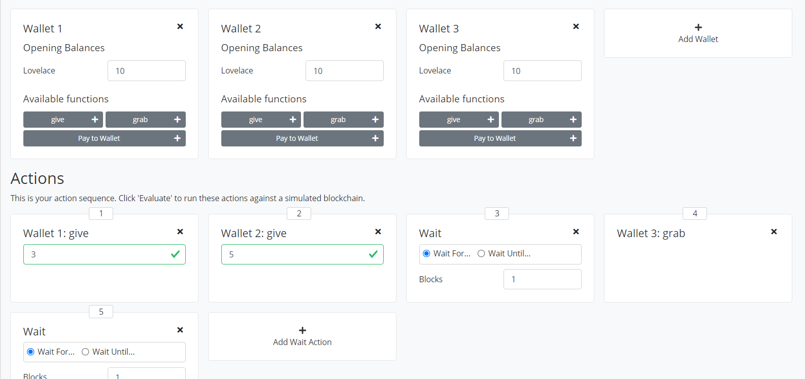
By clicking to evaluate, you see 4 transactions:
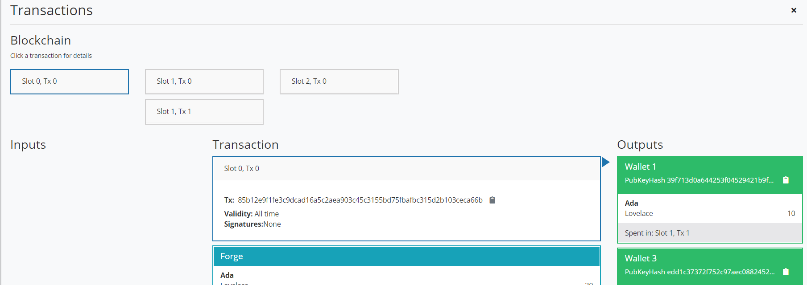
- Slot 0, Tx 0 The first is the genesis transaction which gives the 10 ADA's to the wallets
- Slot 1, Tx 0 && Slot 1, Tx 1, which show the give call and wallet 2 gives 5 Lovelace, and 5 Lovelaces are locked to the wallet and wallet 1 gives 3 Lovelaces and other 7 are locked in the wallet
- Here we can see the actual address, the address of teh Validator
- So how it works the  Plutus script , is hashed and this hash defines the address that is used.
  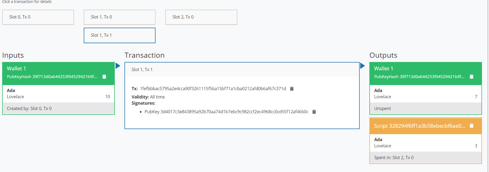
  

And the grab transaction from Wallet 3 where it gets all the Lovelaces that were given from Wallet 1 && 2.
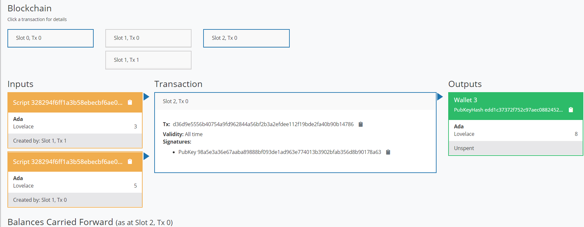
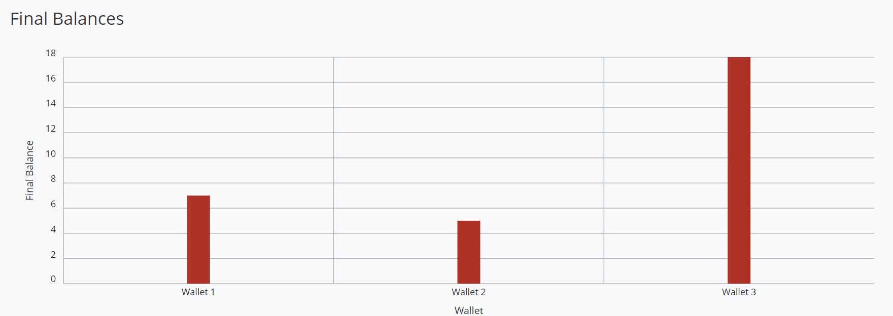

As already mentioned, this validator always succeeds. But this validator can be used from anybody who wants to donate some ADA🙂

Go into Burn.hs

- throw error messages
  We modify our validator to throw some errors.
```
{-# INLINABLE mkValidator #-} 
mkValidator :: Data -> Data -> Data -> () 
mkValidator _ _ _ = traceError "BURNT!"
```

By making the validator always fail, it makes it so that there is no way to grab the funds. The scenario is the same completely with the Gift.hs but In essence the funds are sitting in script address never to have access to them again effectively burning the ADA.
The transaction as we can see below is not validated after the execution of this validation script.
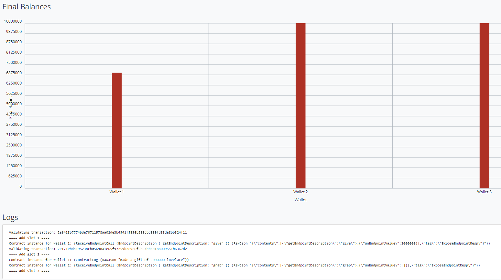

But here as we can see in the results we have the error message of "Burnt":
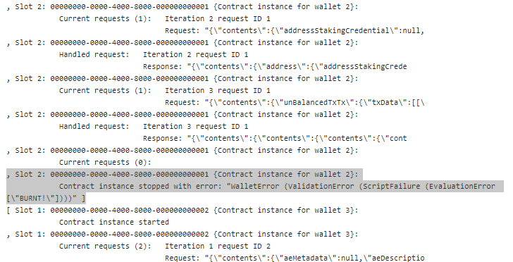

- FortyTwo.hs

    - Unlock ADA with redeemer . The validator script has changed
      In this scenario our validator expects a simple redeemer.
```
mkValidator _ r _ 
    | r == I 42 = () 
    | otherwise = traceError "wrong redeemer"

// Meaning:
// if (r == I 42) {
//     return ()
// } else { 
//     traceError "wrong redeemer"
// }

// and also replace with this:
type GiftSchema = 
            Endpoint "give" Integer 
        .\/ Endpoint "grab" Integer
```

We give an arbitrary value at Wallet 2 grab Value like: 100, in order to cause failure of the validation script.
If we put though the value 42, in the grab value of wallet 2, then it the script will be succesfully validated.

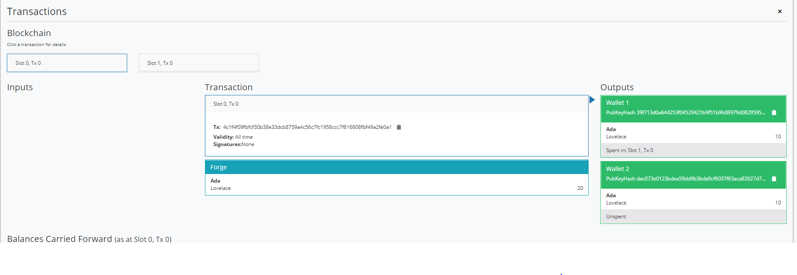
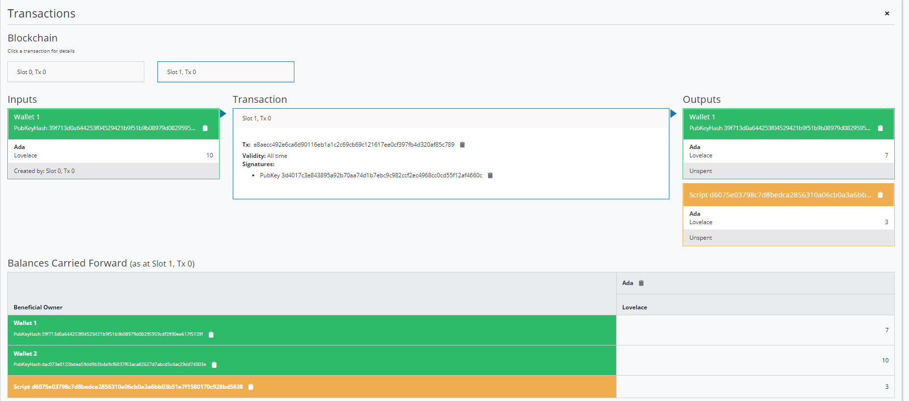
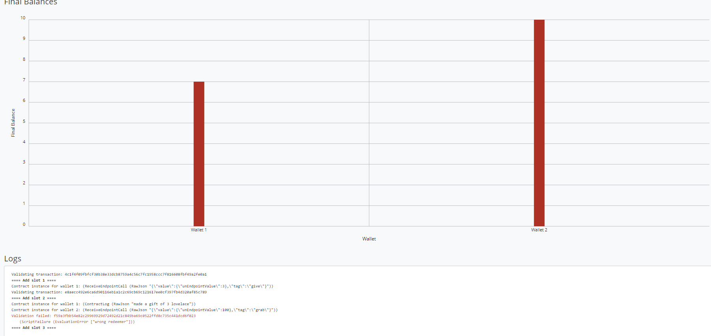


The above ways of creating validation scripts is low level. So let's see how is actually done in real world.

On the other side, if we change the value to 42 and click Evaluate again, we should see that validation succeeds.

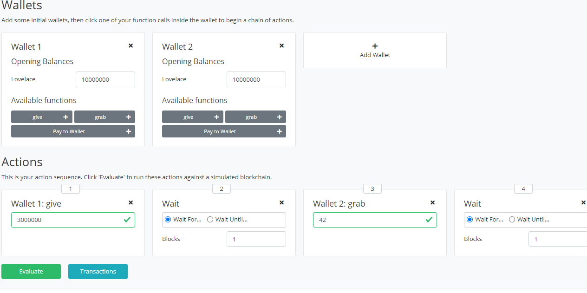

Now we see the third transaction where wallet 2 manages to collect the funds, minus fees.
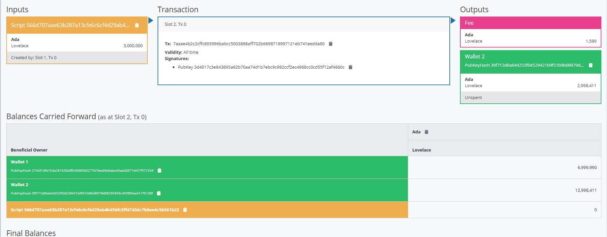

And the final balances are belowm and at logs we don't see any error be thrown.

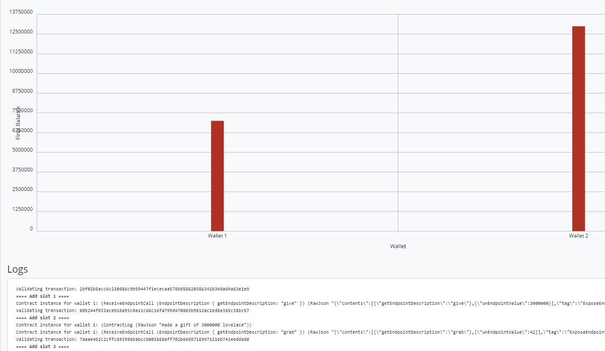

- Typed Validator - Typed.hs

    - Using differEnt types

It is a bit unusual to use () as a return type. Much more natural would be to use Bool to indicate successful or failed validation.
```
mkValidator :: () -> Integer -> ScriptContext -> Bool
```
So, this is a better way to write validation code. The last two types SciprtContext and Bool, but the first two types can be different depending on the situation.

```
{-# INLINABLE mkValidator #-} 
mkValidator :: () -> Integer -> ScriptContext -> Bool 
mkValidator _ r _ = traceIfFalse "wrong redeemer" $ r == 42

Take an integer it returns a bool(true,false) based on if the transaction has succeeded or not.
In order to run, the validator script, you need to declare some types, the data types that you expect.
The user needs to send the specific integer 42 in the grab otherwise transaction can't be completed.
ValidatorCtx: Is how context actually looks like, and is the type which is used for contect Validation
```
- Typed Validator
```
data Typed -- the purpose of this instance is to declare the types for the datum and the redeemer.
instance Scripts.ValidatorTypes Typed where
    type instance DatumType Typed = ()
    type instance RedeemerType Typed = Integer

inst :: Scripts.ScriptInstance Typed 
inst = Scripts.validator @Typed 
    $$(PlutusTx.compile [|| mkValidator ||]) 
    $$(PlutusTx.compile [|| wrap ||]) 
  where 
    wrap = Scripts.wrapValidator @() @Integer //@datum type @redeemer type

validator :: Validator 
validator = Scripts.validatorScript inst
```
- Creation of custom types
```
{-# INLINABLE mkValidator #-}
mkValidator :: () -> Integer -> ScriptContext -> Bool
mkValidator _ r _ = traceIfFalse "wrong redeemer" $ r == 42 -- traceIfFalse: takes a String and a Bool and returns a Bool
-- if (r !== 42) { wrong redeemer }
-- otherwise the transaction succeeds

data Typed -- the purpose of this instance is to declare the types for the datum and the redeemer.
instance Scripts.ValidatorTypes Typed where
    type instance DatumType Typed = ()
    type instance RedeemerType Typed = Integer

typedValidator :: Scripts.TypedValidator Typed
typedValidator = Scripts.mkTypedValidator @Typed -- compile the validator. It takes our new data type as parameter
                                                 -- and produces something of type TypedValidator
    $$(PlutusTx.compile [|| mkValidator ||])
    $$(PlutusTx.compile [|| wrap ||])
  where
    wrap = Scripts.wrapValidator @() @Integer -- this type we also compile a wrapValidator function that takes
                                              -- the datum and redeemer types.

validator :: Validator
validator = Scripts.validatorScript typedValidator -- to create an untyped validator from our typed version.

valHash :: Ledger.ValidatorHash -- take hash and turn it into ValidatorHash
valHash = Scripts.validatorHash typedValidator

scrAddress :: Ledger.Address
scrAddress = scriptAddress validator -- script address calculated

type GiftSchema =
            Endpoint "give" Integer
        .\/ Endpoint "grab" Integer

-- ABOVE IS THE ONCHAIN PART
-- BELOW THE OFFCHAIN PART
give :: AsContractError e => Integer -> Contract w s e () -- give Endpoint
give amount = do
    let tx = mustPayToTheScript () $ Ada.lovelaceValueOf amount -- mustPayToTheScript: which allows us to pass in just ()
                                                                -- as we longer need to construct a value of type Data
    ledgerTx <- submitTxConstraints typedValidator tx
    void $ awaitTxConfirmed $ txId ledgerTx
    logInfo @String $ printf "made a gift of %d lovelace" amount

NOTES: Give attention to : toData, fromData
plutus/blob/plutus-tx/src/PlutusTx/IsData/Class.hs check this class.
The type class isData it takes a type paremeter a and it has two methods "toData, fromData" which enables to transalte instances of this class, convert such a type to datam and trying to convert it back to an A, that it may be fail because not all values may be valid values.
// how does plutus converts the haskell custom datatypes to the integer and unit, to the data type that is the actual low level implementation.
```
The behaviour of this code will be identical to the previous script.
Above are explained some examples of simple Validators with Datum, redeemer and Context

- isData.hs

Custom data types
Define a custom data type:
```
newtype MySillyRedeemer = MySillyRedeemer Integer  
-- define a custom data type and use it in Validator

PlutusTx.unstableMakeIsData ''MySillyRedeemer
-- how haskell converts back and forth between IsData and MySillyRedeemer

{-# INLINABLE mkValidator #-}
mkValidator :: () -> MySillyRedeemer -> ScriptContext -> Bool
mkValidator _ (MySillyRedeemer r) _ = traceIfFalse "wrong redeemer" $ r == 42
```

In the offchain part of the code we need to change a bit the grab endpoint
```
grab r = do
    utxos <- utxoAt scrAddress
    let orefs   = fst <$> Map.toList utxos
        lookups = Constraints.unspentOutputs utxos      <>
                  Constraints.otherScript validator
        tx :: TxConstraints Void Void
        tx      = mconcat [mustSpendScriptOutput oref $ Redeemer $ PlutusTx.toData (MySillyRedeemer r) | oref <- orefs]
        -- above instead of using I r, we use toData (MySillyRedeemer r)
    ledgerTx <- submitTxConstraintsWith @Void lookups tx
    void $ awaitTxConfirmed $ txId ledgerTx
    logInfo @String $ "collected gifts"
```
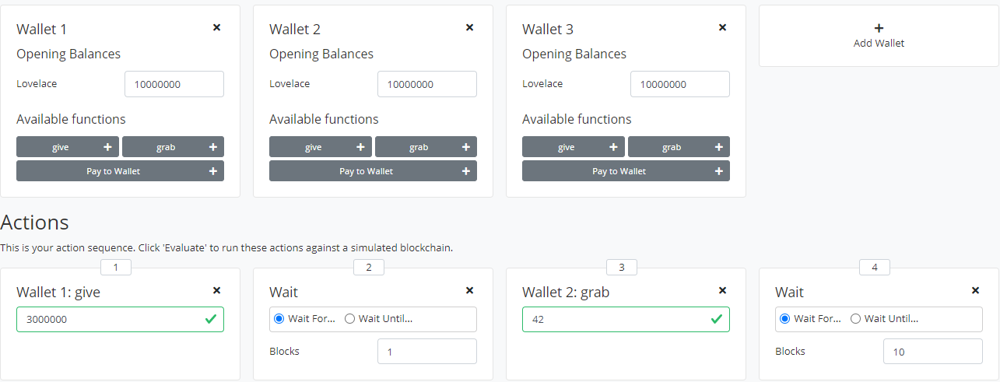

We can see as results:
Slot 1, Tx 0

Slot 11, Tx O:
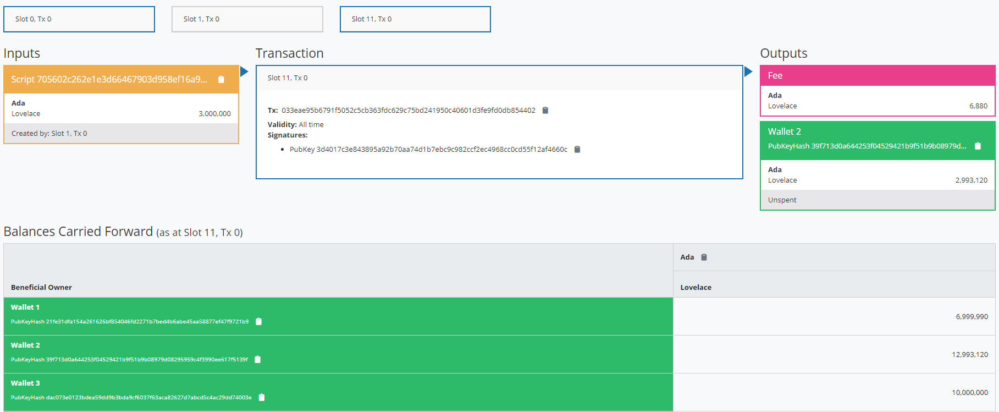
Here we see that there is a quite simple type class defined called IsData.

- Homework 1

```
{-# INLINABLE mkValidator #-}
-- This should validate if and only if the two Booleans in the redeemer are equal!
mkValidator :: () -> (Bool, Bool) -> ScriptContext -> Bool
mkValidator () (a, b) _ = traceIfFalse "wrong redeemer" $ a == b
```
Set the Redeemer Type to the (Bool, Bool) type
```
data Typed
instance Scripts.ValidatorTypes Typed where
    type instance DatumType Typed = ()
    type instance RedeemerType Typed = (Bool, Bool)
```

```
typedValidator :: Scripts.TypedValidator Typed
typedValidator = Scripts.mkTypedValidator @Typed -- compile the validator. It takes our new data type as parameter
                                                 -- and produces something of type TypedValidator
    $$(PlutusTx.compile [|| mkValidator ||])
    $$(PlutusTx.compile [|| wrap ||])
  where
    wrap = Scripts.wrapValidator @() @(Bool, Bool)
```

```
validator :: Validator
validator = Scripts.validatorScript typedValidator -- FIXED! 

valHash :: Ledger.ValidatorHash
valHash = Scripts.validatorHash typedValidator -- FIXED! 

scrAddress :: Ledger.Address
scrAddress = scriptAddress validator -- FIXED!
```

After compiling the solution of Homework1.hs we have to deal with 2 different cases:
1. The one when the two boolean values are different
2. The one when the two boolean values are same
   Below we can see the first case and the results:

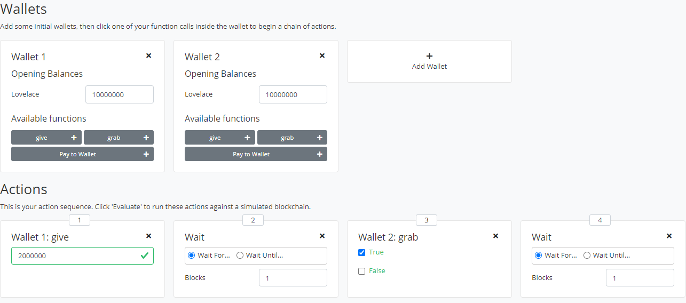

At this case we expect our validator to throw an error "wrong redeemer"
Results:
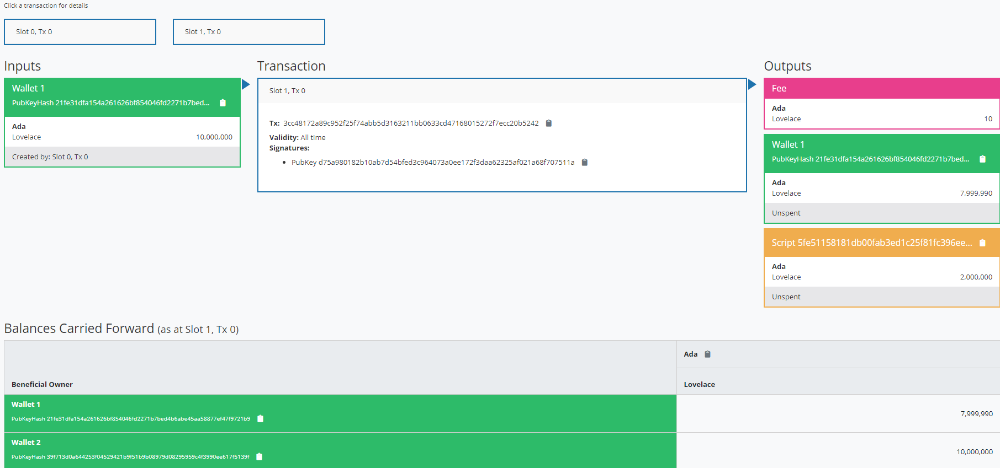
and the expected error message
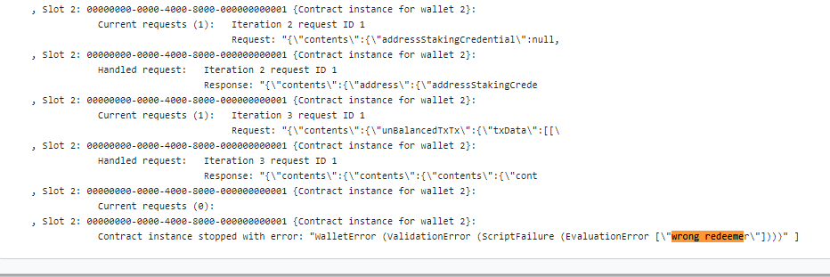

And case 2 where the two Booleans in the redeemer are equal: We notice that the validation succeeds, so the wallet grabs succesfully the lovelaces from Wallet 1.

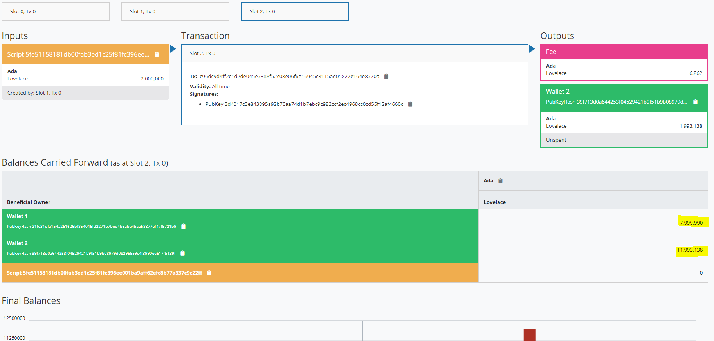

- Homework 2


The logic is similar with the Homework 1 and we expect to see similar results. 2 Cases:
1. The one when the two boolean values are different, described as flag1/flag2
2. The one when the two boolean values are same

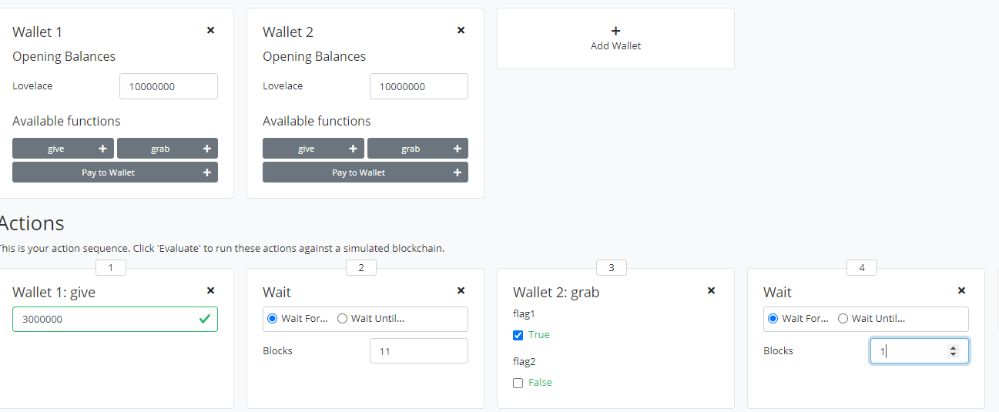
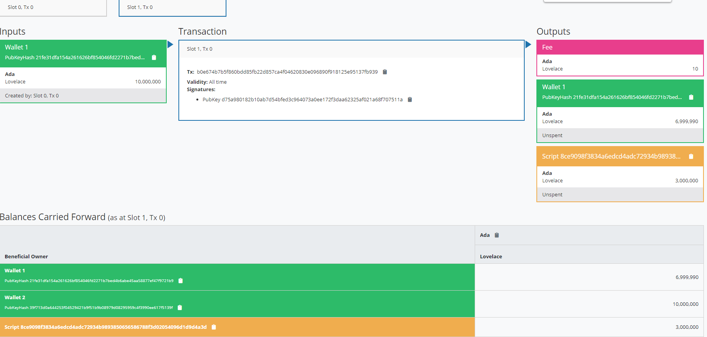

Where we see wallet 2, didn't grab any lovelace from Wallet 1. The logs have the expected result in this case of "wrong redeemer".
In contrary to the other case we see the below results:


The official lecture can be found here https://www.youtube.com/watch?v=IEn6jUo-0vU&feature=youtu.be&ab_channel=LarsBr%C3%BCnjes of Lars Brünjes on YouTube.

The above documentation is created from Angelos Dionysios Kappos for personal use and in order to share it with Cardano community for educational purposes and everybody who is interested to learn the smart contracts of Cardano, and not to be sold.

**Social Media Links Links/ More information:**

**Linkedin** : https://www.linkedin.com/in/angelos-dionysios-kappos-4b668140/

**Who is SapioPool Cardano Community** : https://sapiopool.com/

**Participate in Sapiopool Discord channel here** : https://discord.com/invite/HRK9gGE9ax

**Twitter accounts:**
- https://twitter.com/angelokappos
- https://twitter.com/sapiopool

**Sapiopool Youtube :**
- https://www.youtube.com/channel/UCcPH2RMsszRGJ2awvLdMKzQ
