#PLUTUS PIONEER PROGRAM

##Documentation Week 3

##Creator: Kappos Angelos

##Credits to: Sapiopool Cardano Community

##Contents

##Topics covered:
- **Set up playground for Week 3**
- **Script context.**
- **Time handling.**
- **Parameterized contracts.**
- **Homework/Solutions**

**Set up Week 3**:
To your Plutus repository:
```
cd cardano/plutus 
git pull
git checkout 219992289c6615e197069d022735cb4059d43229
-- this tag can be found in file cabal.project in week03 of plutus-pioneer-program repository--
```
Similar to the previous weeks-lectures, our next steps here are to build Plutus && start server/client: - Building phase will take a bit-
```
nix build -f default.nix plutus.haskell.packages.plutus-core 
nix-build -A plutus-playground.client 
nix-build -A plutus-playground.server 
nix-build -A plutus-playground.generate-purescript 
nix-build -A plutus-playground.start-backend 
nix-build -A plutus-pab 
nix-shell 
cd plutus-pab 
plutus-pab-generate-purs 
cd ../plutus-playground-server 
plutus-playground-generate-purs
```

Start Server
```
plutus-playground-server
```
new Terminal
```
cd cardano/plutus
nix-shell
cd plutus-playground-client
```
start Client (this may take a while)
```
npm run start
```
in Browser
```
https://localhost:8009/
```
new Terminal
```
cd cardano/plutus-pioneer-program
git fetch
cd ../plutus
nix-shell
cd  ../plutus-pioneer-program/code/week03/
cabal update  
cabal build
```


##VESTING 
**Datum**
```
data VestingDatum = VestingDatum -- Datum has two information
    { beneficiary :: PubKeyHash  -- beneficiary
    , deadline    :: POSIXTime   -- deadline
    } deriving Show

PlutusTx.unstableMakeIsData ''VestingDatum
```
**Validator**

**TxInfo** : describes the spending transaction. The transaction edits inputs and outputs which is expressed inside TxInfo

```
{-# INLINABLE mkValidator #-} 
-- in this case we don't need any information in the Redeemer 
mkValidator :: VestingDatum -> () -> ScriptContext -> Bool -- 2 conditions: 
mkValidator dat () ctx = traceIfFalse "beneficiary's signature missing" signedByBeneficiary && -- the correct beneficiary can unlock a UTxO 
                                                                                               -- sitting at this address 
                         traceIfFalse "deadline not reached" deadlineReached -- transaction is only executed after the deadline is reached. 
  where 
    info :: TxInfo -- provides both the signatures and the timing information. 
    info = scriptContextTxInfo ctx 
    signedByBeneficiary :: Bool 
    signedByBeneficiary = txSignedBy info $ beneficiary dat 
    deadlineReached :: Bool 
    deadlineReached = contains (from $ deadline dat) $ txInfoValidRange info -- check the deadline we need the txInfoValidRange field of TxInfo 
                                                                             -- which gives us a value of type SlotRange.
```
**Wallet Part of the script**
```
data GiveParams = GiveParams -- Wallet part of the script 
    { gpBeneficiary :: !PubKeyHash 
    , gpDeadline    :: !POSIXTime 
    , gpAmount      :: !Integer 
    } deriving (Generic, ToJSON, FromJSON, ToSchema) 
type VestingSchema = 
            Endpoint "give" GiveParams 
        .\/ Endpoint "grab" ()
```
**give endpoint**
```
give :: AsContractError e => GiveParams -> Contract w s e () 
give gp = do 
    let dat = VestingDatum -- the DATUM is constructed from the GiveParams above 
                { beneficiary = gpBeneficiary gp 
                , deadline    = gpDeadline gp 
                } 
        tx  = mustPayToTheScript dat $ Ada.lovelaceValueOf $ gpAmount gp 
    ledgerTx <- submitTxConstraints typedValidator tx 
    void $ awaitTxConfirmed $ txId ledgerTx 
    logInfo @String $ printf "made a gift of %d lovelace to %s with deadline %s" 
        (gpAmount gp) 
        (show $ gpBeneficiary gp) 
        (show $ gpDeadline gp)
```
**grab endpoint**
```
grab :: forall w s e. AsContractError e => Contract w s e () 
grab = do 
    now   <- currentTime 
    pkh   <- pubKeyHash <$> ownPubKey 
    utxos <- Map.filter (isSuitable pkh now) <$> utxoAt scrAddress -- The grabber needs to find the UTxOs that they can actually consume 
    -- which is performed by the isSuitable helper function 
    -- This looks at the all UTxOs and only keeps those that are suitable. 
    if Map.null utxos 
        then logInfo @String $ "no gifts available" 
        else do 
            let orefs   = fst <$> Map.toList utxos 
                lookups = Constraints.unspentOutputs utxos  <> 
                          Constraints.otherScript validator 
                tx :: TxConstraints Void Void 
                tx      = mconcat [mustSpendScriptOutput oref $ Redeemer $ PlutusTx.toData () | oref <- orefs] <> 
                          mustValidateIn (from now) 
            ledgerTx <- submitTxConstraintsWith @Void lookups tx 
            void $ awaitTxConfirmed $ txId ledgerTx 
            logInfo @String $ "collected gifts" 
  where 
    isSuitable :: PubKeyHash -> POSIXTime -> TxOutTx -> Bool 
    isSuitable pkh now o = case txOutDatumHash $ txOutTxOut o of -- checks that the Datum hash exists 
        Nothing -> False 
        Just h  -> case Map.lookup h $ txData $ txOutTxTx o of 
            Nothing        -> False 
            Just (Datum e) -> case PlutusTx.fromData e of 
                Nothing -> False 
                Just d  -> beneficiary d == pkh && deadline d <= now 
                -- checks that the beneficiary of the UTxO is the public key hash of the grabber && 
                -- checks that the deadline is not in the future.
```
**Note the call:**
```
mustValidateIn (from now)
```
If we do not do this, the default would be the infinite slot range, and this would cause validation to fail in our case.

We could use a singleton slot here, but, if there were any issues, for example network delays, and the transaction arrived at a node a slot or two later, then validation would no longer work.

Another thing to note is that, if there is no suitable UTxO available, we don't even try to submit the transaction. We want to make sure that when the grabber submits, they get something in return. Otherwise they would have to pay fees for a transaction that doesn't have any outputs.


**Grab function checks**
• it has to find the UTXO, that can be consumed.
• it checks the datum hash if it's available
• it tries to deserialize the datum hash and if that succeeds then this is actually the interesting check, and it checks the beneficiary of tha tUTXO is the public key hash of this wallet and that the deadline doesn't lie in the future.
• Of course it checks if there aren't any UTXOs available it doesn't do anything.

**Vesting program in order to run needs:**

• hash of beneficiary

• deadline slot

• amount to be sent

Problem here? We miss the hash of Beneficiary and the appropriate Deadline. An easy way to take this is to evaluate the script by running it without the Public Key Hash. When we do this, the script will generate is our simulation the public Key Hash for both Wallet 1 && 2.
But let's do it the way that Lars showed inside the lecture:

```
cd cardano/plutus
nix-shell
cd ../plutus-pioneer-program/code/week03/
cabal repl
```
then in order to solve the above problems one by one we follow the below guide:
```
> :l src/Week03/Vesting.hs
> import Ledger
> import Wallet.Emulator
> :i Wallet
> :i walletPubKey
> :t pubKeyHash
> pubKeyHash $ walletPubKey $ Wallet 2
> pubKeyHash $ walletPubKey $ Wallet 3
```
Copy the first Hash which matches to Wallet 2 and paste in playground when we give from Wallet 1.
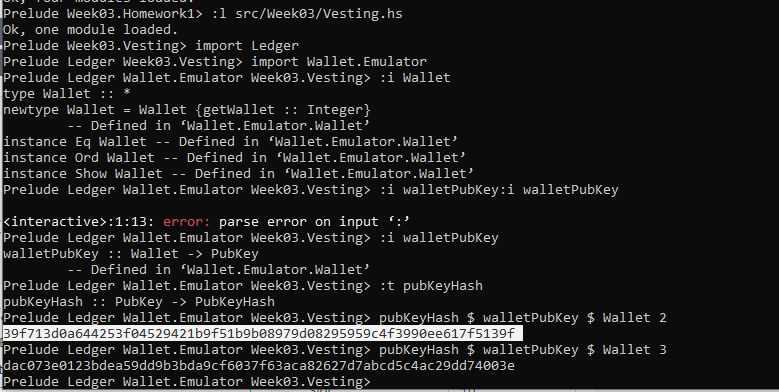

hash1: 39f713d0a644253f04529421b9f51b9b08979d08295959c4f3990ee617f5139f
hash2: dac073e0123bdea59dd9b3bda9cf6037f63aca82627d7abcd5c4ac29dd74003e
Next problem is the Deadline
```
> import Ledger.TimeSlot
> :t slot
> :t slotToBeginPOSIXTime
> :i SlotConfig
> import Data.Default
> :i Default
> def :: SlotConfig 
> slotToBeginPOSIXTime def 10
> slotToBeginPOSIXTime def 20
```
Where we take the POSIXTime for 10 && 20 where we copy the values of each case and we paste to playground in order to check our scenario.  
  
10: 1596059101000,  
20: 1596059111000,  
30: 1596059121000  
Copy the hashes and deadline slots from Wallet 2 -picture below-, paste it and rerun it.  
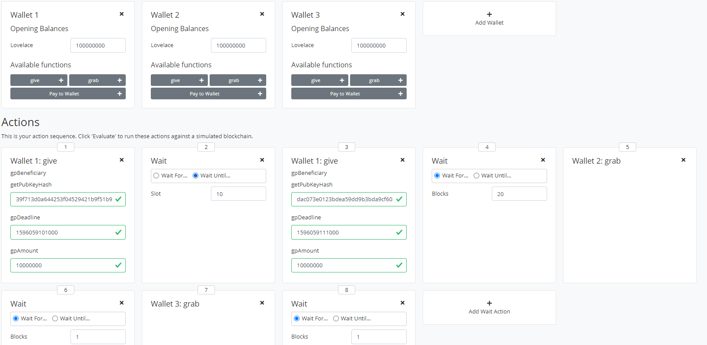
What we see:
Slot 0: Genesis transaction (see above picture)  
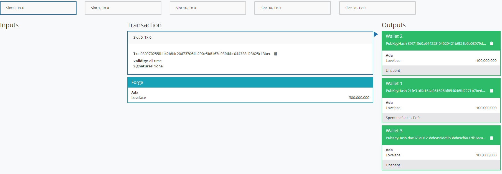
Slot 1: Wallet 1 sends to wallet 2 10000000 Lovelace, the signature && It also pays lovelace fee 10  

Slot 10: Wallet 1 gives to wallet 3 at this time the same amount of Lovelaces.  

Slot 30:  

Slot 31:  


**AND THE FINAL RESULTS:**
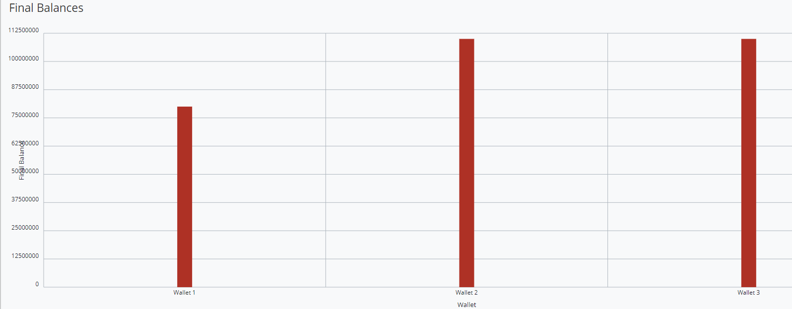
And the logs we see here show what we have done above to our example:
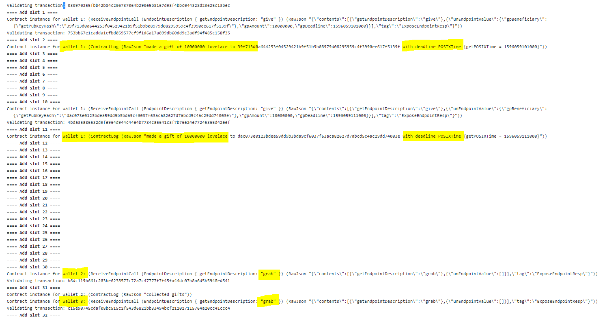
Running the same script with different deadline, we get the message:
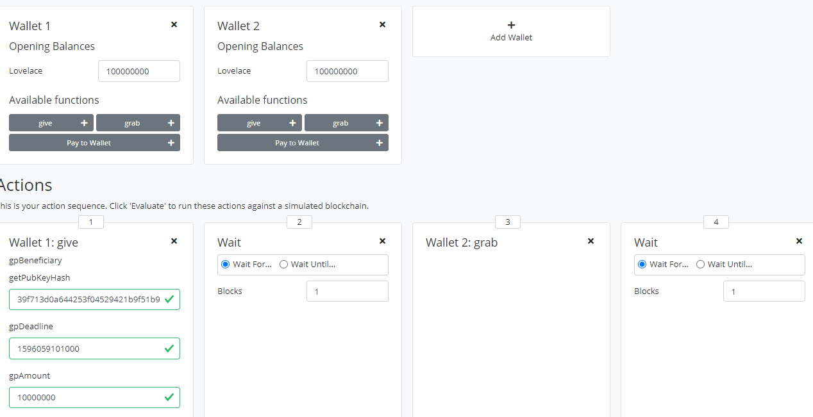
with the results shown below, are different from the previous example because we changed the deadline we check:
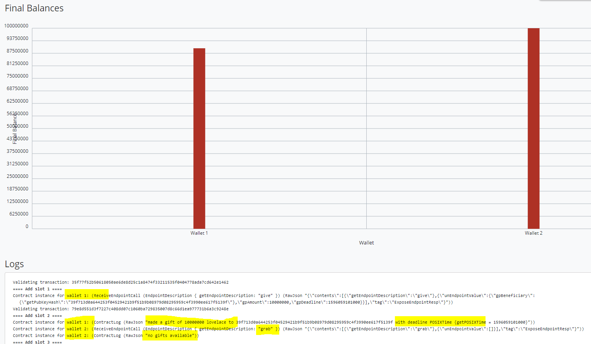

## PARAMETRISED
Is a parametrized Vesting script. With optimisation of the previous code but similar logic.
Datum
We parametrise the script of Vesting
```
data VestingParam = VestingParam 
   { beneficiary :: PubKeyHash 
   , deadline    :: Slot 
   } deriving Show
```
**Validator**

We change just the function header and the parts that previously accessed the datum.
```
mkValidator :: VestingParam -> () -> () -> ScriptContext -> Bool -- Use Unit as our Datum Type, 
                                                                 -- add a new validation argument of new type VestingParam 
                                                                 -- mkValidator takes a VestingParam and returns a custom validator 
                                                                 -- based on those params 
mkValidator p () () ctx = traceIfFalse "beneficiary's signature missing" signedByBeneficiary && 
                          traceIfFalse "deadline not reached" deadlineReached 
  where 
    info :: TxInfo 
    info = scriptContextTxInfo ctx 
    signedByBeneficiary :: Bool 
    signedByBeneficiary = txSignedBy info $ beneficiary p 
    deadlineReached :: Bool 
    deadlineReached = contains (from $ deadline p) $ txInfoValidRange info
```
**Validator Haskell Template**

In this scenario, since the `mkValidator` now accepts parameters as its input, we have to change the validator template. Additionally, we don't know the value of `p` at compile time, so it is impossible to compile them all together. One way around is to use the `PlutusTx.applyCode` function and compile both the `p` and `mkValidator` objects separately, and at the end, combine them all together.

```
typedValidator :: VestingParam -> Scripts.TypedValidator Vesting
typedValidator p = Scripts.mkTypedValidator @Vesting
    ($$(PlutusTx.compile [|| mkValidator ||]) `PlutusTx.applyCode` PlutusTx.liftCode p)
    $$(PlutusTx.compile [|| wrap ||])
  where
    wrap = Scripts.wrapValidator @() @()
```
And the `validator` function applies `typedValidator` to its input argument using function compositions:

```
validator :: VestingParam -> Validator
validator = Scripts.validatorScript . typedValidator
```

**Wallet Part of the script**
```
data GiveParams = GiveParams -- WALLET PART of chain 
    { gpBeneficiary :: !PubKeyHash 
    , gpDeadline    :: !POSIXTime 
    , gpAmount      :: !Integer 
    } deriving (Generic, ToJSON, FromJSON, ToSchema) 
type VestingSchema = 
            Endpoint "give" GiveParams 
        .\/ Endpoint "grab" POSIXTime -- difference related to Vesting.hs
```
**Give endpoint**
```
give :: AsContractError e => GiveParams -> Contract w s e () 
give gp = do 
    let p  = VestingParam 
                { beneficiary = gpBeneficiary gp 
                , deadline    = gpDeadline gp 
                } 
        tx = mustPayToTheScript () $ Ada.lovelaceValueOf $ gpAmount gp 
    ledgerTx <- submitTxConstraints (typedValidator p) tx -- whenever typedValidator is needed, 
                                                          -- we must pass in the params 
    void $ awaitTxConfirmed $ txId ledgerTx 
    logInfo @String $ printf "made a gift of %d lovelace to %s with deadline %s" 
        (gpAmount gp) 
        (show $ gpBeneficiary gp) 
        (show $ gpDeadline gp)
```
**Grab endpoint**
```
grab :: forall w s e. AsContractError e => POSIXTime -> Contract w s e () 
grab d = do                             -- additional parameter. It can be used to contruct parameters, 
                                        -- along with our own public key hash 
    now   <- currentTime 
    pkh   <- pubKeyHash <$> ownPubKey 
    if now < d                          -- no need of isSuitable. 
                                        -- checks if now is not earlier that the deadline 
        then logInfo @String $ "too early" 
        else do 
            let p = VestingParam 
                        { beneficiary = pkh -- public Key Hash 
                        , deadline    = d   -- deadline Slot 
                        } 
            utxos <- utxoAt $ scrAddress p  -- address to pass in the parameters 
            if Map.null utxos 
                then logInfo @String $ "no gifts available" 
                else do 
                    let orefs   = fst <$> Map.toList utxos 
                        lookups = Constraints.unspentOutputs utxos      <> 
                                  Constraints.otherScript (validator p) 
                        tx :: TxConstraints Void Void 
                        tx      = mconcat [mustSpendScriptOutput oref $ Redeemer $ PlutusTx.toData () | oref <- orefs] <> 
                                  mustValidateIn (from now) 
                    ledgerTx <- submitTxConstraintsWith @Void lookups tx 
                    void $ awaitTxConfirmed $ txId ledgerTx 
                    logInfo @String $ "collected gifts"
```
So, all we need to do is to check that now is not earlier than the deadline.
```
if now < d
   then logInfo @String $ "too early"
   else do
   ...
```
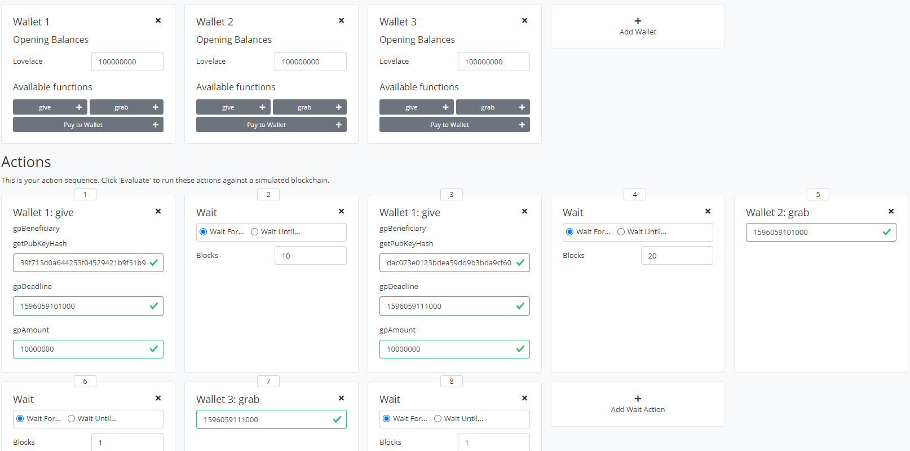

**Final Results:**

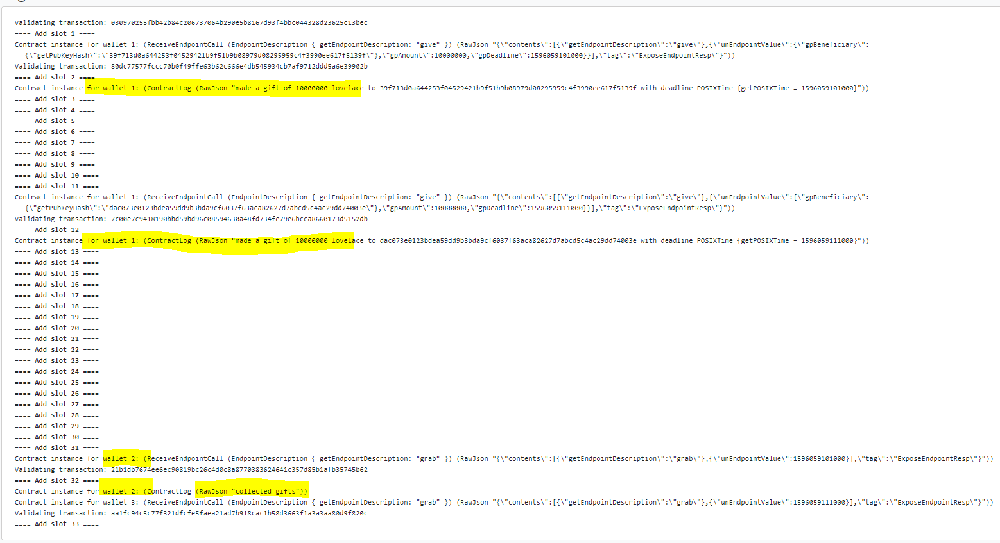

## Homework1:
The beneficiary of Wallet 1 will be Wallet 2, and the beneficiary of Wallet 2 will be Wallet 1.
- Wallet 1 address: 21fe31dfa154a261626bf854046fd2271b7bed4b6abe45aa58877ef47f9721b9

- Wallet 2 address: 39f713d0a644253f04529421b9f51b9b08979d08295959c4f3990ee617f5139f

- Deadline of slot 1 is 10: 1596059101000

- Deadline of slot 1 is 5: 1596059096000
  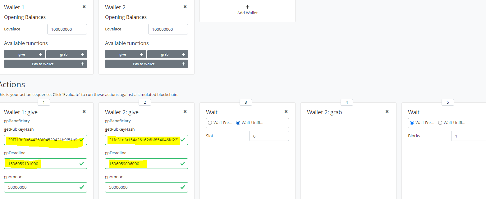

What we see here:

Slot 1, Tx 0
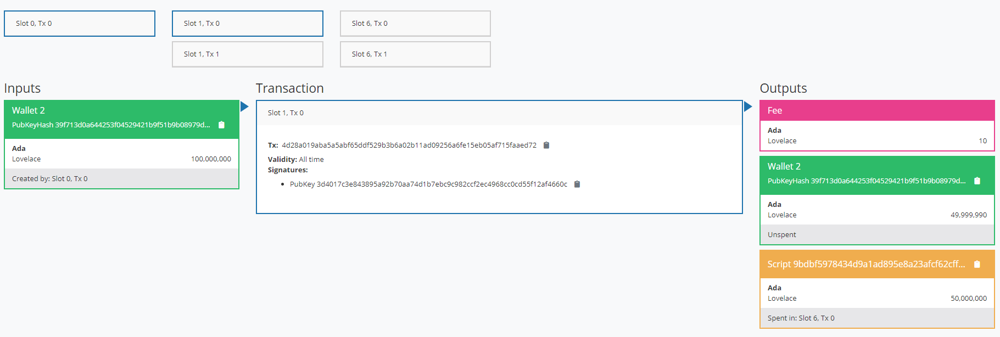


Slot 1, Tx 1


Slot 6, Tx 0


Slot 6, Tx 1
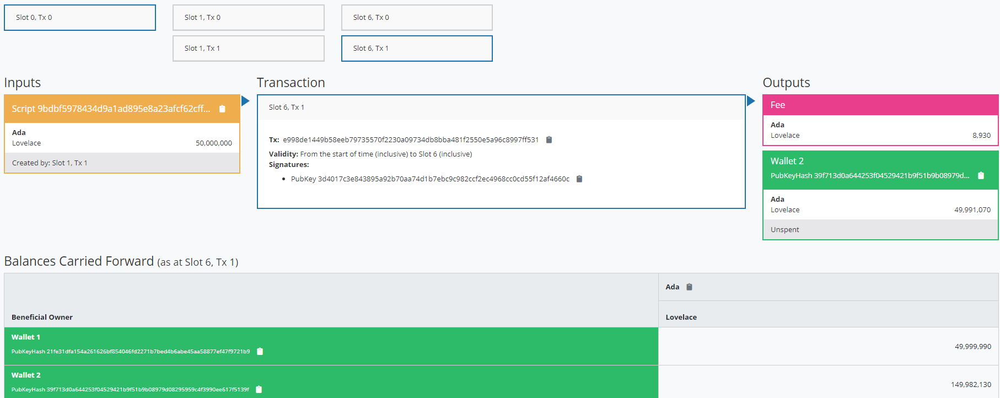

**FINAL RESULTS:**
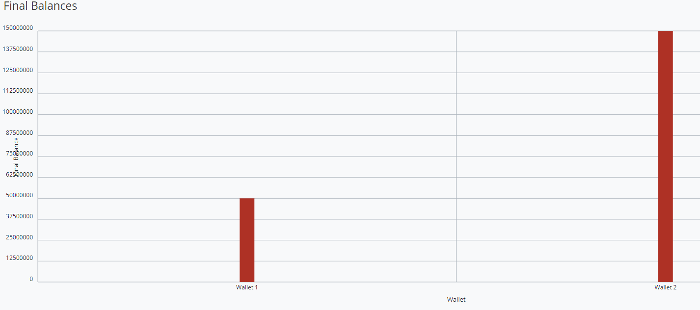


As expected Wallet 1 has roughly 50 ADA and Wallet 2 has roughly 150 ADA

## Homework 2:
- Wallet 2 address: 39f713d0a644253f04529421b9f51b9b08979d08295959c4f3990ee617f5139f
- Deadline 10: 1596059101000
- Deadline 20: 1596059111000

**Genesis Block**


**Slot 1, Tx 0**


**Slot 2, Tx 0**


**Slot 20, Tx 0**
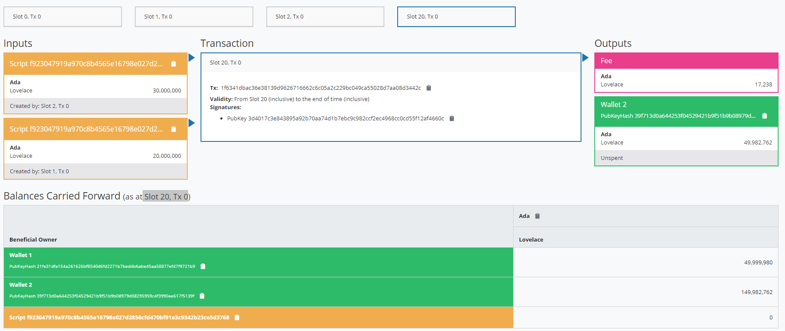

**FINAL RESULTS/LOGS**
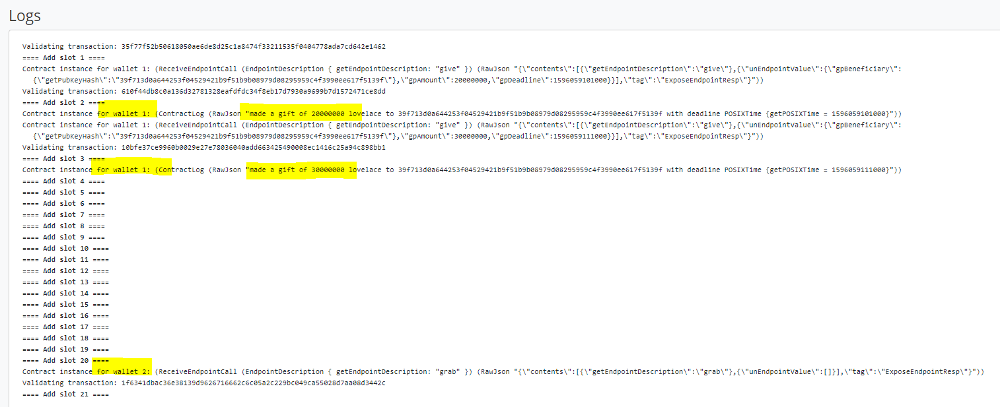


The **official lecture** can be found here [https://www.youtube.com/watch?v=6_rfCCY9_gY&t=52s&ab_channel=LarsBr%C3%BCnjes] of Lars Brünjes on YouTube.

The above documentation is created from Angelos Dionysios Kappos for personal use and in order to share it with Cardano community for educational purposes and everybody who is interested to learn the smart contracts of Cardano, and not to be sold.


**Social Media Links Links/ More information:**

**Linkedin** : [https://www.linkedin.com/in/angelos-dionysios-kappos-4b668140/](https://www.linkedin.com/in/angelos-dionysios-kappos-4b668140/)

**Who is SapioPool Cardano Community** : [https://sapiopool.com/](https://sapiopool.com/)

**Participate in Discord channel here** : [https://discord.com/invite/HRK9gGE9ax](https://discord.com/invite/HRK9gGE9ax)

**Twitter accounts:**

- [https://twitter.com/angelokappos](https://twitter.com/angelokappos)

- [https://twitter.com/sapiopool](https://twitter.com/sapiopool)

**Sapiopool Youtube** :
- [https://www.youtube.com/channel/UCcPH2RMsszRGJ2awvLdMKzQ](https://www.youtube.com/channel/UCcPH2RMsszRGJ2awvLdMKzQ)
